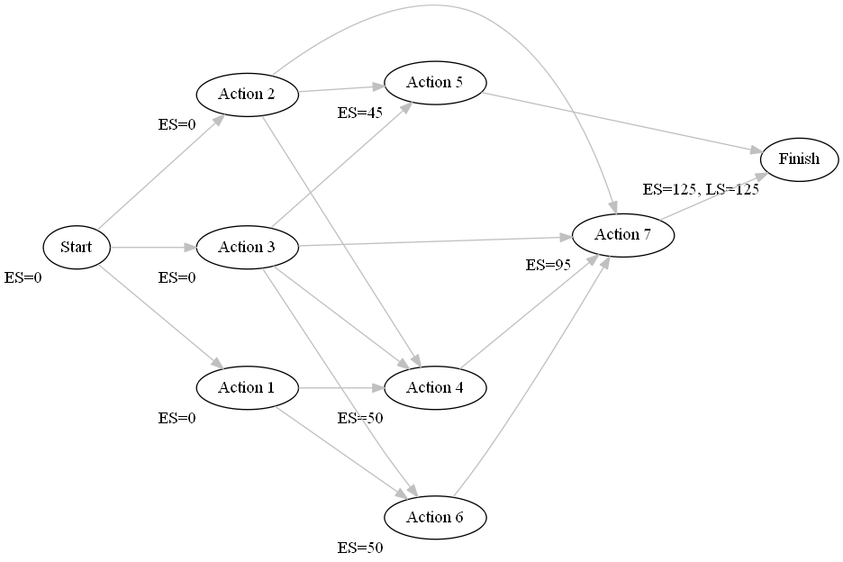

Scheduling | 

Basic steps:

0. (Optional) Draw a direction graph to represent the tasks and their dependencies

1. Calculate the earliest start (ES) of each task, starting with the start task and working your way forward in the graph. ES = max(duration(dependencies))

2. Finish has Latest Start (LS) = ES(finish)
3. Calculate the LS of each tast, LS(A) = min(ES(Tasks that depend on A)), this wime working your way backwards from the finish.

4. Calculate the Slack of each node Slack = LS - ES. Then determine in which order to schedule the tasks, using minimum Slack as the priorty function.

Make a table to determine how to schedule the tasks according to constraints. 
1. Add each task in the order given by the priority function. 
2. Determine the start time first by placing it after any dependencies. 
3. Then make sure the required durable/reusable resources (saw/hammer) are available.
4. Make sure there is the required consumable resource (But I think the problem is defined such that this is never a constraint)
5. Add the task to the table and block the resources required during the duration of the task. If the task consumes a resource, put it in the slot before (representing consuming the resource at the start turn of the tast). If the the task produces a resource, add it in the last slot (the resource is produced at completion of the task)

Read the table and write down:

Start times:

task | turn
-----|-----
Start | 0
Action 1 | 0
Action 2 | 0
Action 3 | 0
Action 4 | 95
Action 5 | 45
Action 6 | 50
Action 7 | 115
Finish | 145

Nail consumption:

turn | +-
-----|---
Turn 35 | +1
Turn 45 | +1
Turn 45 | -1
Turn 145 | -1

Saw use:
Turn 0..45
Turn 50..145

Hammer use:
Turn 45..145